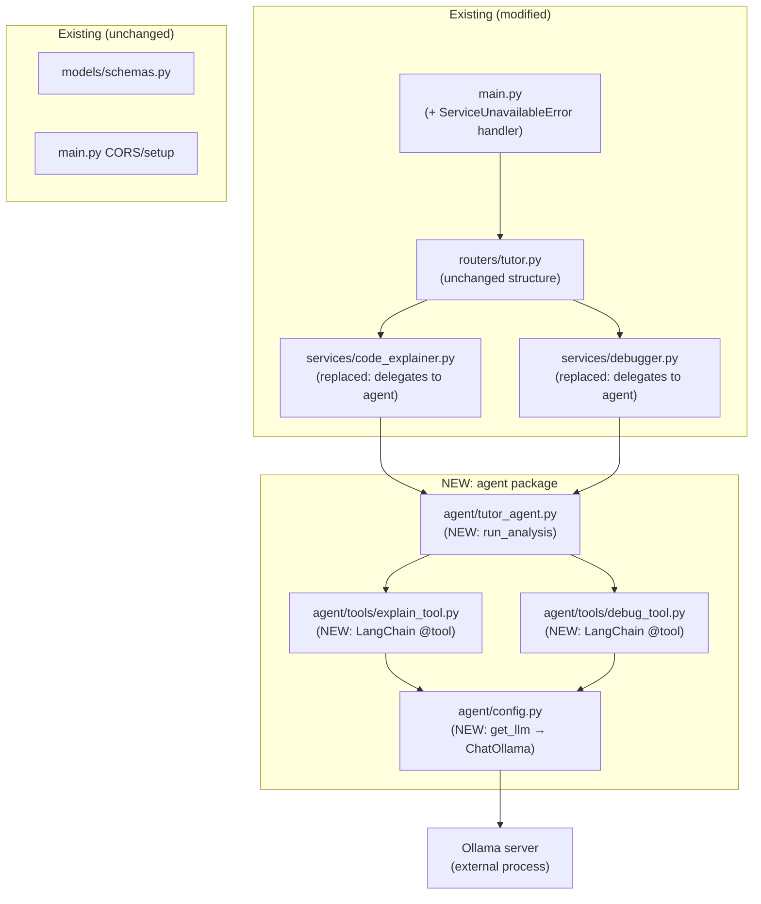
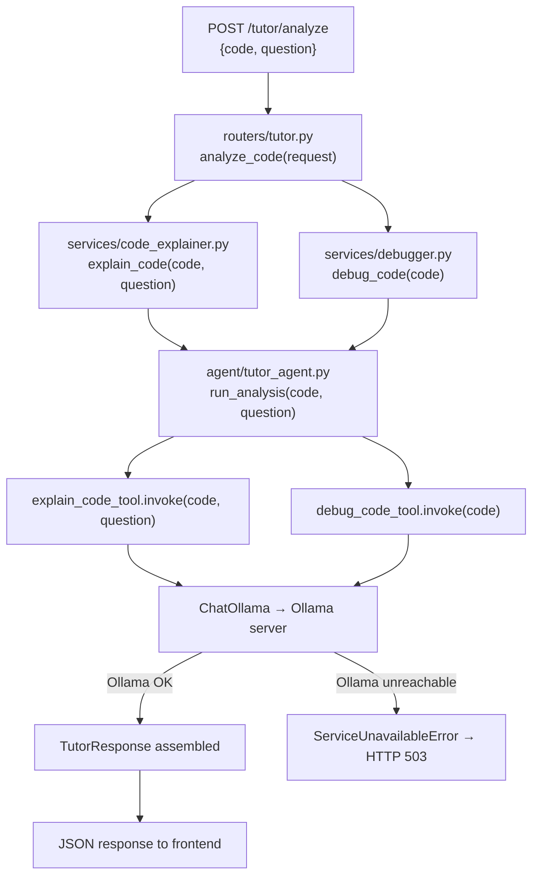

# Phase 2: LangChain + Ollama Integration — Implementation Plan

**Status**: 🔄 In Progress (Phase 1, 2 Complete)

**Last Updated**: 2026-05-23

## Requirements & Context

### Core Requirements
- **What:** Replace dummy services with real LangChain tools backed by a local Ollama LLM
- **Why:** Sprint 1 shipped static dummy responses. Sprint 2 delivers actual AI-powered code explanation and debugging through a locally-hosted model — no external API calls
- **Who requested:** Project owner (Sprint 2 scope)
- **Constraint:** Local-only AI (Ollama); no external API services. Python 3.12.3, venv under `backend/venv/`
- **Success metric:** `POST /tutor/analyze` returns real LLM-generated explanations and debug feedback; Ollama offline triggers HTTP 503

### Feature Specifications

A student submits Python code (and an optional question) via the frontend. The system now returns genuine AI-generated explanations and structured debugging output instead of static dummy text.

**Behavior:**
- `question` field (already in schema, previously unused) is now forwarded through the call chain and included in the LLM prompt
- Code explanation: German-language, step-by-step analysis of the submitted code, incorporating the student's question when provided
- Debug analysis: LLM identifies syntax/logic errors and returns a structured result `{error_found: bool, suggestion: str}`
- When Ollama is not reachable: API returns HTTP 503 with a clear German error message — no silent fallback to dummy output
- LLM connection parameters (base URL, model name) are read from `.env` at startup

**User interaction:**
1. Student types Python code in the frontend editor and optionally enters a question
2. Frontend POSTs `{"code": "...", "question": "..."}` to `POST /tutor/analyze`
3. Backend calls both LangChain tools (explain + debug) and assembles `TutorResponse`
4. Frontend renders the real LLM explanation, error status, and suggestion

### Current System State
- `services/code_explainer.py`: returns a static string with line count ("Dein Code hat N Zeilen...")
- `services/debugger.py`: rule-based line-by-line check for missing colons in `for`/`if` statements
- `routers/tutor.py`: calls `explain_code(request.code)` — `request.question` is never forwarded
- `main.py`: no error handler for service-level exceptions
- `start.sh`: starts backend + frontend, no Ollama lifecycle management
- No `agent/` package, no `.env`, no `python-dotenv`, no LangChain packages

### Out of Scope
- ReAct agent pattern (agent decides which tool to call) — Phase 3 concern
- RAG / PDF ingestion — Phase 3 concern
- Student memory / progress tracking — Phase 3 concern
- pytest test suite — no tests currently exist; quality gate is manual API testing
- Pre-commit hooks
- Production CORS hardening

### Related Decisions
- **langchain-community vs langchain-ollama**: `langchain-ollama` chosen — dedicated, maintained package with first-class Ollama support; avoids the heavier community bundle
- **ReAct agent vs direct tool calls**: Direct calls chosen — simpler, predictable for a two-tool pipeline; agent orchestration adds latency and complexity without value at this stage
- **Silent fallback vs 503 on Ollama failure**: 503 chosen — returning dummy output when the LLM is down would silently degrade user experience; failing loudly is safer and debuggable
- **Config in code vs `.env`**: `.env` via `python-dotenv` chosen — standard for local dev, consistent with `.gitignore` entry that already excludes `.env`

## Overview

### What We Want to Do
Wire a LangChain + Ollama LLM into the existing FastAPI service layer, replacing dummy implementations in `code_explainer.py` and `debugger.py` with real LLM calls, while keeping all surrounding code (schemas, router structure, main.py CORS) untouched.

### Why We Need This
- **Problem**: The API returns static dummy text regardless of the submitted code
- **Gap**: No actual AI processing; `question` field is never used
- **Impact**: System cannot fulfil its stated purpose as an AI tutor
- **Solution**: Introduce an `agent/` package that owns LLM configuration and tool definitions; services become thin delegators to this package

### Approach
Three incremental phases: (1) scaffolding + config, (2) LangChain tool definitions, (3) wiring tools into the FastAPI service layer. Each phase leaves the system running — existing dummy behavior is preserved until Phase 3 replaces it.

### Architectural Decision

**Decision:** Introduce a new `backend/agent/` package as the LLM layer; keep `services/` as the HTTP-facing adapter layer.

**Why this approach:**
- Clear separation: `agent/` owns LLM concerns; `services/` owns API-contract concerns
- Services remain the single integration point for routers — router code changes minimally
- `agent/` is independently testable without HTTP context
- Follows the existing `models/`, `services/`, `routers/` layering pattern already in the codebase

**Alternatives considered:**
- **Inline LLM calls in services**: rejected — mixes LLM configuration, prompting, and HTTP adapter concerns in one file
- **LLM calls directly in the router**: rejected — routers should not contain business logic per existing pattern

**Pattern followed:**
- Same three-layer separation as `models/schemas.py` → `services/code_explainer.py` → `routers/tutor.py`

## Shared Definitions

### Interfaces and Data Structures

**`run_analysis` return contract** (defined in `backend/agent/tutor_agent.py`, consumed by both services):
```
{
  "explanation": str,   # German-language, step-by-step code explanation
  "error_found": bool,  # True if the LLM identified an error
  "suggestion": str     # Error description or "Kein Fehler gefunden."
}
```

**Updated `explain_code` signature** (Phase 3 replacement):
```
explain_code(code: str, question: str | None = None) -> str
```

**`debug_code` signature** (unchanged external contract, implementation replaced):
```
debug_code(code: str) -> tuple[bool, str]
```

**`ServiceUnavailableError`** (custom exception, defined in `backend/agent/tutor_agent.py`):
- Raised when Ollama is unreachable or returns a connection error
- Caught in `main.py` and converted to HTTP 503

### Configuration and Flags

| Variable | Default | Description |
|---|---|---|
| `OLLAMA_BASE_URL` | `http://localhost:11434` | Ollama server base URL |
| `OLLAMA_MODEL` | `llama3.2` | Model name served by Ollama |

Source: `backend/.env` (git-ignored) and `backend/.env.example` (committed).

### Conventions
- All LLM prompts are in German (system + user messages)
- Debug tool always returns valid JSON `{"error_found": bool, "suggestion": str}` — LLM output is parsed robustly (strip markdown fences, fall back to `error_found=False` on parse failure)
- New Python packages belong in `backend/agent/` — not in `services/` or `routers/`
- `__init__.py` files are empty (no re-exports) — mirrors existing package style

## Phase Summary

| Phase | Delivers | Status | Detail File |
|---|---|---|---|
| 1: Foundation | Config, `.env`, `agent/` package scaffold, updated `start.sh` | ✅ | `phase-2-langchain-ollama/phase-1-foundation.md` |
| 2: LangChain Tools | `explain_code_tool` and `debug_code_tool` as LangChain tools | ✅ | `phase-2-langchain-ollama/phase-2-tools.md` |
| 3: Integration | Services wired to agent, 503 error handler, `question` forwarded | ✅ | `phase-2-langchain-ollama/phase-3-integration.md` |
| Quality Gate | Full end-to-end manual test + regression check | ⏸️ | *(in this file)* |
| Documentation | README, `.env.example`, sprint status | ⏸️ | *(in this file)* |

Each implementation phase follows the **implement → review → test** cycle:
1. `implementation-executor` completes the phase → commit `[impl]`
2. `code-reviewer` reviews the phase → findings or approval
3. `test-executor` writes tests for the phase → commit `[test]`

## Architecture and Design

### System Changes



### Data Flow



### Key Integration Points
- **Router → Services**: `routers/tutor.py` calls `explain_code(request.code, request.question)` — the only change to the router is forwarding `question`
- **Services → Agent**: Both `code_explainer.py` and `debugger.py` call `run_analysis(code, question)` and extract their respective fields from the returned dict
- **Agent → Tools**: `tutor_agent.py` calls both tools directly (no agent loop); result is assembled into the shared return dict
- **Tools → Ollama**: Both tools call `get_llm()` from `agent/config.py`; `get_llm()` reads `OLLAMA_BASE_URL` and `OLLAMA_MODEL` from environment
- **Error propagation**: Connection errors from Ollama surface as `ServiceUnavailableError` in `tutor_agent.py`; `main.py` registers an exception handler that returns HTTP 503

## Configuration

### New Environment Variables
- `OLLAMA_BASE_URL`: Base URL of the Ollama server. Default: `http://localhost:11434`
- `OLLAMA_MODEL`: Model identifier served by Ollama. Default: `llama3.2`

### Configuration Changes
- **Added**: `backend/.env` — local config, git-ignored (already in `.gitignore`)
- **Added**: `backend/.env.example` — template committed to repo
- **Modified**: `backend/requirements.txt` — three new packages: `langchain`, `langchain-ollama`, `python-dotenv`
- **Modified**: `start.sh` — Ollama process lifecycle added

## Final Quality Gate ⏸️

After all three implementation phases complete their implement → review → test cycles, this gate validates the full integrated system.

**Focus:**
- End-to-end request with real Ollama running
- 503 behavior when Ollama is stopped
- `question` field flows through to LLM prompt
- `start.sh` starts and stops cleanly

**Process:**
- Tester runs `start.sh`, executes manual test scenarios below
- If any scenario fails: escalate to the phase that owns the failing component

**Definition of Done:**
- [ ] `POST /tutor/analyze` with valid code returns a non-empty LLM-generated explanation
- [ ] `POST /tutor/analyze` with `question` set produces an explanation that addresses the question
- [ ] `POST /tutor/analyze` while Ollama is stopped returns HTTP 503
- [ ] `debug_code_tool` returns `error_found: true` for `for i in range(5)\n    print(i)` (missing colon)
- [ ] `start.sh` starts Ollama, backend, and frontend; Ctrl+C stops all three cleanly with no orphan processes
- [ ] No regressions: existing `GET /` health-check still returns `{"status": "ok"}`

**Git Commit:** `[test] Quality gate: end-to-end LangChain + Ollama integration`

---

## Documentation ⏸️

**Handled by:** `doc-writer` agent (follows `~/.claude/documentation-standard/`)

**Areas affected by this implementation:**
- `README.md` — Ollama prerequisite and setup steps; updated `start.sh` usage; Sprint 2 marked complete in sprint plan; updated data flow diagram; updated function table (new signatures); updated example response (real LLM output note)
- `backend/.env.example` — living configuration reference for all environment variables
- Sprint plan section in README — mark Sprint 2 as complete, update Sprint 3 description if needed

**Git Commit:** `[docs] Phase 2: LangChain + Ollama integration documentation`

---

## Testing Strategy

### Unit Testing
- `agent/config.py`: `get_llm()` returns a `ChatOllama` instance with correct base_url and model from env
- `agent/tools/explain_tool.py`: tool is importable; `invoke` returns a non-empty string (requires Ollama running, or mock)
- `agent/tools/debug_tool.py`: JSON parsing logic handles clean JSON, JSON with markdown fences, and malformed output
- `agent/tutor_agent.py`: `run_analysis` returns dict with all three keys; raises `ServiceUnavailableError` on connection failure

### Integration Testing
- `POST /tutor/analyze` happy path with real Ollama
- `POST /tutor/analyze` with Ollama stopped → 503

### Manual Testing
- [ ] Submit `{"code": "for i in range(5)\n    print(i)", "question": "Warum kein Doppelpunkt?"}` — verify explanation mentions the question topic
- [ ] Submit syntactically correct code — verify `error_found: false`
- [ ] Stop Ollama, submit request — verify HTTP 503 and clear German error message
- [ ] Run `./start.sh` from project root — verify all three processes start; press Ctrl+C — verify all stop with no orphans

## Risks and Mitigation

### Technical Risks
- **Risk**: LLM output for `debug_code_tool` is not valid JSON
- **Impact**: `debug_code_tool` crashes or returns wrong result
- **Mitigation**: Robust JSON parsing — strip markdown fences, use `json.loads` inside try/except, fall back to `{"error_found": false, "suggestion": "Analyse nicht möglich."}`
- **Likelihood**: Medium (LLMs regularly wrap JSON in markdown code blocks)

### Operational Risks
- **Risk**: Ollama not installed or model not pulled on developer machine
- **Impact**: All LLM calls fail with connection error
- **Mitigation**: `start.sh` checks for Ollama availability before starting backend; README documents `ollama pull llama3.2` as prerequisite
- **Likelihood**: High on first setup

## Success Criteria

1. `POST /tutor/analyze` returns genuine AI-generated German explanation for any valid Python code
2. `question` field is visibly incorporated into the explanation when provided
3. `debug_code_tool` correctly identifies the missing-colon error case (`error_found: true`)
4. Ollama offline triggers HTTP 503 — not a crash, not a silent fallback
5. `start.sh` manages the full process lifecycle (Ollama + backend + frontend) without orphan processes

## Implementation Updates

**2026-05-23**: Initial tracker created. Complication noted: existing `start.sh` already exists but lacks Ollama lifecycle management — Phase 1 will extend it, not replace it from scratch.

---

## Related Documentation

- `README.md` — Sprint plan, data flow, API reference
- `backend/.env.example` — Configuration reference (created in Phase 1)
- `docs/implementations/phase-2-langchain-ollama/phase-1-foundation.md`
- `docs/implementations/phase-2-langchain-ollama/phase-2-tools.md`
- `docs/implementations/phase-2-langchain-ollama/phase-3-integration.md`
