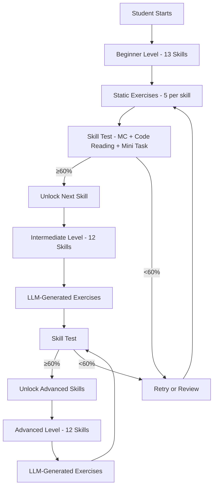
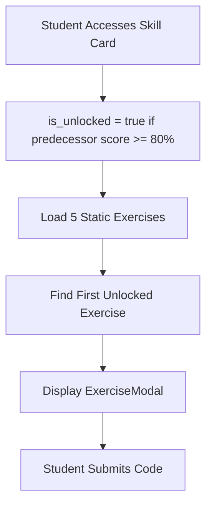
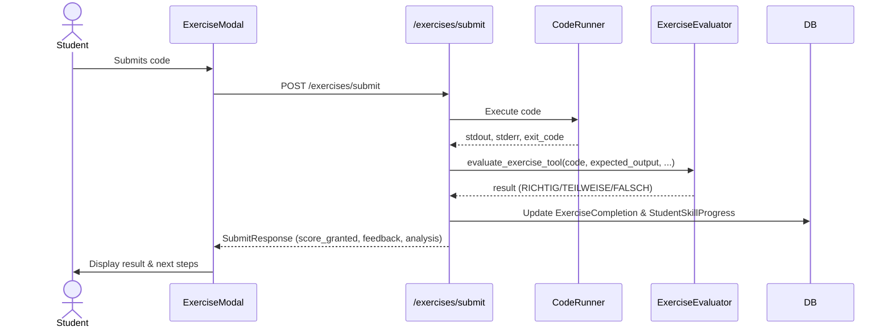
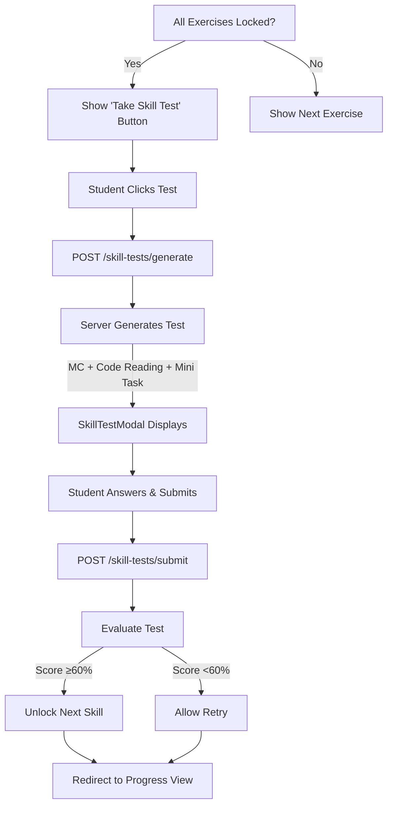

# Exercise & Skill Progress System - Feature Guide

**Use this document when you want to understand how the exercise and skill progression system works in the KI Python Tutor.**

## Prerequisites

- Basic understanding of FastAPI and SQLAlchemy
- Familiarity with Python skill concepts (variables, loops, functions, etc.)
- Understanding of REST API patterns
- Knowledge of LangChain tools for generating and evaluating exercises

## Overview

The Exercise & Skill Progress System is a comprehensive adaptive learning framework that guides students through 37 Python skills organized across 3 progressive levels. Each skill has associated exercises that students complete at their own pace, with the system tracking progress and unlocking subsequent skills based on mastery (≥80% on skill tests). The system uses LLM-powered exercise generation for intermediate and advanced levels, combined with a static library for beginner skills.



## How It Works

### Core Components

- **Skill Tree**: A 37-skill progression framework defining skill dependencies and metadata
- **Exercise Library**: Static exercises for beginner skills; LLM-generated for intermediate/advanced
- **Exercise Evaluator**: LLM tool that scores student code submissions (RICHTIG/TEILWEISE/FALSCH)
- **Skill Test Generator**: Creates three-part tests (multiple choice, code reading, mini-task)
- **Skill Test Evaluator**: Scores student test attempts and determines if skill is unlocked
- **Progress Tracker**: Maintains student skill scores, exercise completions, and user level
- **Code Runner**: Safely executes Python code in a sandboxed environment to validate output

### Process Flow

#### 1. Student Starts with Beginner Skills



**File References**: `backend/routers/exercises.py:GET /exercises/{skill_key}`, `frontend/components/ExerciseModal.tsx:ExerciseModal`

#### 2. Exercise Submission & Scoring



**Scoring Logic**:
- **RICHTIG (Correct)**: +20% to skill score, marks exercise as locked (completed)
- **TEILWEISE (Partial)**: +10% to skill score, exercise remains unlocked for retry
- **FALSCH (Wrong)**: +0% to skill score, exercise remains unlocked for retry

**File References**: `backend/routers/exercises.py:POST /exercises/submit`, `backend/agent/tools/exercise_evaluator_tool.py`

#### 3. Skill Test Trigger & Completion

When a student completes all 5 beginner exercises (all is_locked=true), or reaches the end of intermediate/advanced exercises, they can take the skill test. Passing the test (≥60%) unlocks the next skill.



**File References**: `backend/routers/skill_tests.py:POST /skill-tests/generate`, `backend/routers/skill_tests.py:POST /skill-tests/submit`, `frontend/components/SkillTestModal.tsx:SkillTestModal`

### Key Files and Functions

| File | Function/Class | Purpose |
|------|----------------|---------|
| `backend/models/skill_progress.py` | `SKILL_TREE` | 37-skill metadata: keys, labels, levels, unlock chain |
| `backend/models/skill_progress.py` | `StudentSkillProgress` | Per-user skill score (0–100) and status |
| `backend/models/exercise.py` | `ExerciseCompletion` | Tracks (user, skill, exercise) completion state |
| `backend/models/skill_test.py` | `SkillTestResult` | Records test attempts, score, pass/fail status |
| `backend/data/exercises.py` | `EXERCISES` | Static exercise library for all 13 beginner skills |
| `backend/routers/exercises.py` | `GET /exercises/{skill_key}` | Lists 5 exercises for a skill with unlock status |
| `backend/routers/exercises.py` | `POST /exercises/submit` | Submits code, runs evaluator, updates progress |
| `backend/routers/skill_tests.py` | `POST /skill-tests/generate` | Generates and stores skill test server-side |
| `backend/routers/skill_tests.py` | `POST /skill-tests/submit` | Evaluates test, returns score, unlocks next skill |
| `backend/services/progress_service.py` | `get_or_create_skill_progress()` | Ensures database entry exists for user-skill pair |
| `backend/services/skill_analyzer.py` | `_status_from_score()` | Converts skill score to status (understood/partial/not_understood) |
| `backend/agent/tools/exercise_evaluator_tool.py` | `evaluate_exercise()` | LLM-powered evaluation of student exercise code |
| `backend/agent/tools/exercise_generator_tool.py` | `generate_exercise()` | LLM-powered exercise generation for intermediate/advanced |
| `backend/agent/tools/skill_test_generator_tool.py` | `generate_skill_test()` | Generates MC, code reading, and mini-task questions |
| `backend/agent/tools/skill_test_evaluator_tool.py` | `evaluate_skill_test()` | Scores test questions and determines pass/fail |
| `backend/agent/tools/hint_tool.py` | `get_hint()` | LLM-powered hint generation at 3 levels (basic/intermediate/advanced) |
| `backend/core/code_runner.py` | `run_user_code()` | Executes Python code in sandbox, captures stdout/stderr |
| `frontend/components/ExerciseModal.tsx` | `ExerciseModal` | Modal UI for displaying exercises and code editor |
| `frontend/components/SkillTestModal.tsx` | `SkillTestModal` | Modal UI for skill tests |

## Configuration

### Skill Tree Structure

All 37 skills are defined in `backend/models/skill_progress.py:SKILL_TREE` with the following metadata:

```python
{
    "key": "for_loop",              # Unique identifier used in API/DB
    "label": "For-Schleifen",       # German display name
    "level": "beginner",            # "beginner" | "intermediate" | "advanced"
    "order": 7,                     # Level-local ordering (1-based)
    "unlocks_after": "if_else"      # Previous skill key (or None for level-start)
}
```

**Unlock Chain Logic**: A skill is unlocked when the predecessor skill has score ≥80%. Level-start skills (unlocks_after=None) are always available.

### Exercise Configuration

#### Beginner Level (Static)

Static exercises are defined in `backend/data/exercises.py:EXERCISES` as a dictionary mapping skill_key to a list of 5 exercise objects:

```python
{
    "id": "variables_1",
    "skill_key": "variables",
    "order": 1,
    "title": "Einfache Variable",
    "description": "Erstelle eine Variable `name` mit dem Wert `'Python'` und gib sie aus.",
    "expected_output": "Python",
    "test_type": "output_match",
    "hint": "Verwende das = Zeichen um einer Variable einen Wert zuzuweisen."
}
```

**test_type**: Currently only `"output_match"` is supported (comparing stdout to expected_output).

#### Intermediate & Advanced Levels (LLM-Generated)

Exercises for intermediate and advanced levels are generated on-demand via `exercise_generator_tool.invoke()`, which returns a JSON structure with the same fields as static exercises.

### Database Tables

- **`student_skill_progress`**: `(user_id, skill_key) → score (0–100), status, updated_at)`
- **`exercise_completions`**: `(user_id, skill_key, exercise_id) → score_granted (0/10/20), is_locked, created_at)`
- **`skill_test_results`**: `(user_id, skill_key) → score (0–100), passed (bool), attempt_number, generated_test (JSON), created_at)`
- **`learning_events`**: History of analysis events (not directly used by exercise system, but available for auditing)

### Environment Variables (if any)

No exercise-specific environment variables. System uses `OPENAI_API_KEY` or Ollama settings from main project configuration.

## Error Handling

### Common Error Scenarios

- **Skill not found**: Returns HTTP 404 with message "Skill '{skill_key}' nicht gefunden."
- **Exercise not found**: Returns HTTP 404 with message "Exercise '{exercise_id}' nicht gefunden."
- **Code execution error**: Captures stderr and returns in SubmitResponse.stderr; score is 0
- **LLM generation failure**: Falls back to generic prompt or returns HTTP 503 if LLM unavailable
- **Unauthenticated request**: Returns HTTP 401; all endpoints require `get_current_user` dependency
- **Test session expired**: If server-side test data is deleted, returns HTTP 404

### Troubleshooting

- **Exercise shows as locked but student hasn't completed it**: Check ExerciseCompletion table; score_granted=20 marks as locked. Clear entries if needed.
- **Skill score not updating**: Verify StudentSkillProgress record exists and is being updated. Check logs for LLM errors.
- **Skill test not generating**: Check that OPENAI_API_KEY is set or Ollama is running. Check logs for LLM errors.
- **Student can't progress to next skill**: Verify predecessor skill score ≥80% in StudentSkillProgress. Skill unlock logic is checked on each GET request.

## Limitations and Considerations

- **Static exercises only for Beginner**: Intermediate/Advanced rely on LLM generation, so quality varies with model capability
- **No exercise hints for non-beginner**: Hint tool is available, but only beginner exercises have pre-written hints in the database
- **Skill test generation is rate-limited by LLM**: If many students test simultaneously, LLM latency increases
- **Code execution sandbox**: Uses `subprocess.run()` with timeout (5 seconds); infinite loops or long-running code will timeout
- **Skill tree is immutable at runtime**: Adding/removing skills requires code change and database reset
- **User level update**: Computed dynamically on each login/request based on highest-level unlocked skill; not cached
- **Exercise order is non-adaptive**: Students must complete exercises in defined order (even if they know the skill)
- **Test server-side state**: Skill test is generated server-side to prevent tampering, but if server restarts or DB is cleared, test becomes inaccessible

## Student Level Assignment

User level (Anfänger/Fortgeschritten/Profi) is computed based on highest unlocked skill:

- **Anfänger**: Highest unlocked skill is in beginner level
- **Fortgeschritten**: Highest unlocked skill is in intermediate level
- **Profi**: Highest unlocked skill is in advanced level

This is updated on every login and used for personalized LLM prompts in exercise generation and hints.

## Related Topics

- [Main Project README](../../README.md) - System architecture and setup
- [API Reference - Exercises Endpoints](../api-reference/exercises-endpoints.md)
- [API Reference - Skill Tests Endpoints](../api-reference/skill-tests-endpoints.md)
- [Authentication System](authentication.md) - User login and token management
- [Learning Progress Tracking](learning-progress-tracking.md) - Analytics and user progress dashboards
